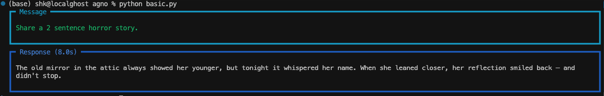
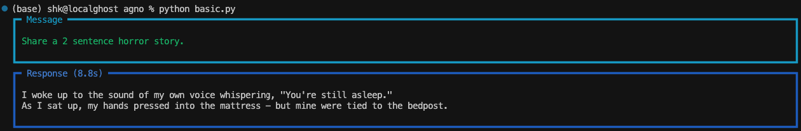
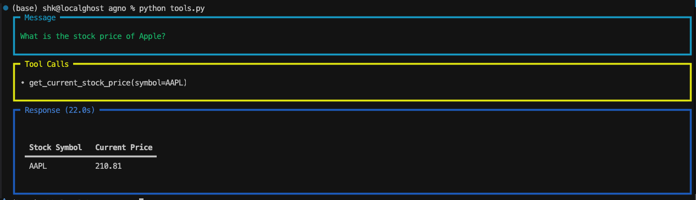
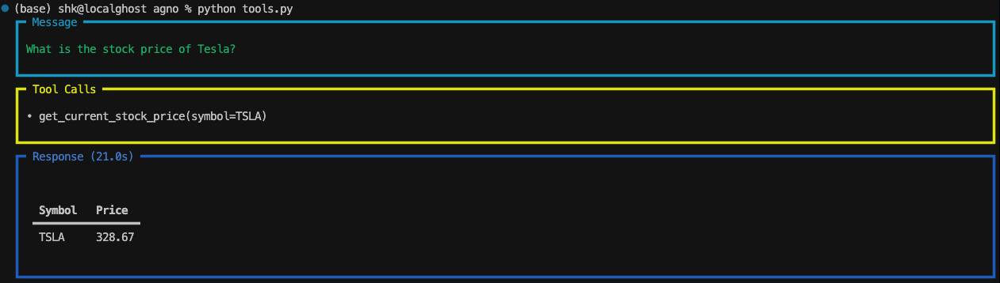

# Gaia Node Examples with Agno Framework

This repository demonstrates how to use the [Agno framework](https://github.com/agno-agi/agno) to interact with a Gaia Node powered by OpenAI-compatible models.

## 🔧 Setup

1. **Install dependencies:**

   ```bash
   pip install -r requirements.txt
   ```

2. Create a .env file with your Gaia node credentials:

    ```
    GAIA_MODEL_NAME=Qwen3-8B-Q5_K_M
    GAIA_API_KEY=gaia-...
    GAIA_NODE_URL=https://qwen72b.gaia.domains/v1
    ```

## 🧪 Examples
### 1. `basic.py`: Text Generation
This script sends a simple prompt to the Gaia Node model and prints a response to the terminal.

```bash
python basic.py
```




### 2. `tools.py`: Using Tools with YFinance
This script demonstrates tool use with the YFinanceTools plugin to fetch live stock price data, such as Apple Inc. (AAPL).

```bash
python tools.py
```



## 📦 Dependencies

- `python-dotenv`
- `agno`
- `yfinance` (used internally by YFinanceTools)

Feel free to extend these examples with your own tools, models, or prompts.