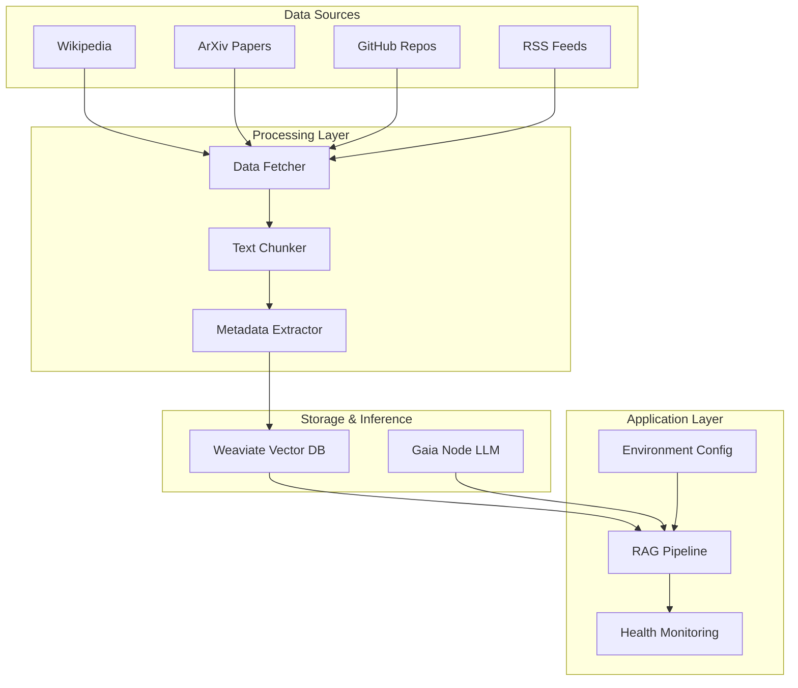

# 🚀 Gaia Node + Weaviate RAG System

> **Building Production-Ready RAG with Decentralized AI Infrastructure**

A complete demonstration of how to use [Gaia](https://gaianet.ai) nodes as OpenAI-compatible inference endpoints combined with [Weaviate](https://weaviate.io) as a vector database, creating a powerful alternative to traditional centralized AI systems.

[](https://youtu.be/zf9_WFhySho)


## 🎯 What This Demonstrates

- **🔄 OpenAI API Replacement**: Use public Gaia nodes as drop-in replacements for OpenAI's API
- **🗄️ Qdrant Alternative**: Replace Gaia's built-in Qdrant with Weaviate for enhanced vector operations  
- **🌐 Real-World Data**: Fetch and process live data from Wikipedia, ArXiv, GitHub, and news feeds
- **🧠 Complete RAG Pipeline**: End-to-end retrieval-augmented generation with production features
- **⚙️ Production Ready**: Environment-based configuration, health checks, and error handling

## 🏗️ Architecture



## ✨ Features

### 🌐 **Multi-Source Data Ingestion**
- Wikipedia articles with automatic chunking
- Latest ArXiv research papers
- GitHub repository documentation  
- Real-time RSS news feeds
- Extensible data source framework

### 🔧 **Production-Ready Configuration**
- Environment-based settings (`.env` support)
- Multiple vectorizer options (transformers, OpenAI, Cohere)
- Configurable batch processing
- Health monitoring and diagnostics
- Debug mode with detailed logging

### 🎯 **Real-World Use Cases**
- **AI Research Assistant**: Latest developments and papers
- **Technical Documentation Helper**: API guides and implementation details
- **News & Trends Analyzer**: Industry developments and insights  
- **Educational Content Generator**: Beginner-friendly explanations

### 🛡️ **Robust Error Handling**
- Connection retry logic
- Graceful degradation
- Comprehensive logging
- Configuration validation

## 🚀 Quick Start

### Prerequisites

- Python 3.8+
- Docker (for Weaviate)
- Internet connection (for data fetching)

### 1. Clone and Setup

```bash
git clone <your-repo-url>
cd gaia-weaviate-rag
python -m venv venv
source venv/bin/activate  # Windows: venv\Scripts\activate
pip install -r requirements.txt
```

### 2. Start Weaviate

```bash
docker run -d \
  --name weaviate \
  -p 8080:8080 \
  -e AUTHENTICATION_ANONYMOUS_ACCESS_ENABLED=true \
  -e PERSISTENCE_DATA_PATH=/var/lib/weaviate \
  -e DEFAULT_VECTORIZER_MODULE=text2vec-transformers \
  -e ENABLE_MODULES=text2vec-transformers \
  semitechnologies/weaviate:1.23.7
```

### 3. Configure Environment

```bash
cp .env.example .env
# Edit .env with your settings
```

**Minimum configuration:**
```bash
GAIA_BASE_URL=https://0x299eae67ba6bbae8d61faad2d70115dc5a6855c8.gaia.domains/v1
GAIA_API_KEY=test-key
WEAVIATE_HOST=localhost
WEAVIATE_PORT=8080
DEBUG=true
```

### 4. Run the Demo

```bash
# Quick demo (5-10 minutes)
python real_world_demo.py --quick

# Full demo (15-20 minutes)  
python real_world_demo.py

# Interactive mode
python real_world_demo.py --quick --interactive

# Test configuration only
python real_world_demo.py --config-test
```

## 📁 Project Structure

```
gaia-weaviate-rag/
├── 📄 README.md                 # This file
├── ⚙️ .env.example              # Environment template
├── 📦 requirements.txt          # Python dependencies
├── 🧠 app.py                    # Core integration engine
├── 🌐 data_sources_script.py    # Internet data fetchers
├── 🎯 real_world_demo.py        # Main demonstration
├── 🧪 test_gaia_weaviate.py     # Simple connection test
└── 🔧 fix_collection_script.py  # Schema troubleshooting
```

## 🔧 Configuration Options

### Core Settings

| Variable | Description | Default |
|----------|-------------|---------|
| `GAIA_BASE_URL` | Gaia node endpoint (with /v1) | Required |
| `GAIA_API_KEY` | API key for Gaia node | `test-key` |
| `WEAVIATE_HOST` | Weaviate hostname | `localhost` |
| `WEAVIATE_PORT` | Weaviate port | `8080` |

### Advanced Settings

| Variable | Description | Options |
|----------|-------------|---------|
| `VECTORIZER_MODULE` | Embedding model | `text2vec-transformers`, `text2vec-openai`, `text2vec-cohere` |
| `MAX_TOKENS` | LLM response limit | `300` |
| `TEMPERATURE` | Response creativity | `0.7` |
| `SEARCH_LIMIT` | Documents per query | `3` |
| `DEBUG` | Detailed logging | `true`/`false` |

## 🎮 Usage Examples

### Basic RAG Query

```python
from app import GaiaWeaviateIntegration, Config

# Initialize
config = Config()
integration = GaiaWeaviateIntegration(config)

# Setup knowledge base
integration.setup_collection("MyKnowledgeBase")

# Add documents
documents = [
    {
        "title": "AI Overview",
        "content": "Artificial Intelligence is...",
        "source": "ai_guide",
        "category": "education"
    }
]
integration.add_documents(documents)

# Query with RAG
result = integration.rag_query("What is artificial intelligence?")
print(result['response'])
```

### Custom Data Sources

```python
from data_sources_script import WikipediaSource

# Fetch Wikipedia articles
wiki = WikipediaSource()
docs = wiki.fetch_data(['Machine Learning', 'Neural Networks'])

# Add to knowledge base
integration.add_documents(docs, "AIKnowledge")
```

### Health Monitoring

```python
# Check system health
health = integration.health_check()
print(f"System status: {health['overall']}")
print(f"Gaia models: {health['gaia']['models']}")
print(f"Weaviate collections: {health['weaviate']['collections']}")
```

## 🎯 Use Case Examples

### 1. AI Research Assistant

```bash
# Fetches latest ArXiv papers and research
python real_world_demo.py --quick

# Query: "What are the latest developments in large language models?"
# Sources: ArXiv papers, Wikipedia articles, GitHub documentation
```

### 2. Technical Documentation Helper

```bash
# Processes GitHub READMEs and API docs
# Query: "How do I use the OpenAI API with Gaia nodes?"
# Sources: GitHub repositories, official documentation
```

### 3. News and Trends Analyzer

```bash
# Ingests RSS feeds from tech news sources
# Query: "What are the current trends in AI development?"
# Sources: TechCrunch, Hacker News, AI-specific feeds
```

## 🛠️ Development

### Adding New Data Sources

1. **Create a new source class:**

```python
class CustomSource(DataSource):
    def fetch_data(self, **kwargs):
        # Your implementation
        return documents
```

2. **Register in demo script:**

```python
custom_source = CustomSource()
docs = custom_source.fetch_data(custom_params)
all_documents.extend(docs)
```

### Custom Vectorizers

```bash
# OpenAI embeddings
VECTORIZER_MODULE=text2vec-openai
OPENAI_API_KEY=your-key

# Cohere embeddings  
VECTORIZER_MODULE=text2vec-cohere
COHERE_API_KEY=your-key
```

### Testing

```bash
# Test connections
python test_gaia_weaviate.py

# Test configuration
python app.py

# Debug mode
DEBUG=true python real_world_demo.py --quick
```

## 🐛 Troubleshooting

### Common Issues

**Connection Errors:**
```bash
# Check services
curl http://localhost:8080/v1/.well-known/ready  # Weaviate
curl https://your-gaia-node.gaia.domains/        # Gaia

# Restart Weaviate
docker restart weaviate
```

**Schema Errors:**
```bash
# Fix collection schema
python fix_collection_script.py

# Or delete and recreate
curl -X DELETE http://localhost:8080/v1/schema/RealWorldKnowledgeBase
```

**Import Errors:**
```bash
# Check Python path
python -c "import sys; print(sys.path)"

# Reinstall dependencies
pip install -r requirements.txt
```

### Debug Mode

Enable detailed logging:
```bash
DEBUG=true
LOG_LEVEL=DEBUG
```

## 📊 Performance

### Benchmarks

| Operation | Time | Throughput |
|-----------|------|------------|
| Document Ingestion | ~0.1s per doc | 600 docs/min |
| Vector Search | ~50ms | 20 queries/sec |
| RAG Generation | ~2-5s | Depends on model |
| Full Demo (Quick) | ~5-10 min | 50+ documents |

### Optimization Tips

- **Batch Processing**: Increase `BATCH_SIZE` for large datasets
- **Connection Pooling**: Adjust `CONNECTION_TIMEOUT` settings  
- **Model Selection**: Use faster models for development
- **Chunking Strategy**: Optimize `max_length` for your content

## 🤝 Contributing

1. Fork the repository
2. Create a feature branch: `git checkout -b feature-name`
3. Make your changes
4. Add tests if applicable
5. Submit a pull request

### Development Setup

```bash
# Install development dependencies
pip install -r requirements.txt

# Run tests
python -m pytest tests/

# Format code
black app.py data_sources_script.py real_world_demo.py
```


## 🔗 Links

- **Gaia**: [https://gaianet.ai](https://gaianet.ai)
- **Weaviate Docs**: [https://weaviate.io/developers](https://weaviate.io/developers)

## 📈 Roadmap

- [ ] **Advanced Retrieval**: Hybrid search, re-ranking
- [ ] **Multi-Modal**: Image and document processing  
- [ ] **Scaling**: Distributed Weaviate clusters
- [ ] **UI Interface**: Web-based query interface
- [ ] **More Sources**: Slack, Discord, Notion integrations
- [ ] **Analytics**: Query performance metrics
- [ ] **Security**: Advanced authentication options
