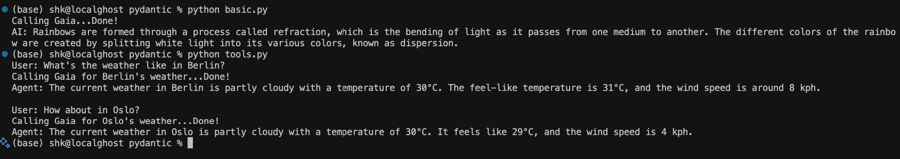

# 🧠 Gaia + Pydantic AI Agent Examples

This example is part of our AI Agent Cookbook and demonstrates how to use a local Gaia node (OpenAI-compatible) as the LLM backend for powerful AI agents built with the **Pydantic AI** framework.



## 🔍 What is Pydantic AI?

Pydantic AI is a Python framework for building modern AI applications that are reliable, type-safe, and predictable. It uses Pydantic models under the hood to guarantee that the outputs of Large Language Models (LLMs) conform to a specific, structured format.

It's particularly useful when you want to:
- Build agents that can reliably call tools (functions).
- Enforce a specific JSON schema for LLM responses.
- Get structured, validated data from unstructured text.
- Create a clear separation between your business logic and the AI model.

## 🚀 What This Example Shows

✅ **1. `basic.py` – Simple Chat Inference with Gaia**
- Uses the `pydantic-ai` `Agent` class to manage a simple conversation.
- Configures the agent with a system prompt and an OpenAI-compatible model pointing to a local Gaia node.
- Displays a terminal spinner while waiting for the response from Gaia.

✅ **2. `tools.py` – Robust Tool-Calling with Gaia**
- Demonstrates how to create a tool from a simple Python function (`get_current_weather`).
- The tool's inputs and outputs are automatically inferred from its type annotations.
- The `Agent` transparently handles the entire tool-calling process: presenting the tool to the LLM, parsing its decision, executing the function, and sending the result back for final analysis.
- The tool in this example fetches **live, real-world weather data** from an external service (`wttr.in`), not mock data.

## 📦 Project Setup

### 🔧 Requirements

Install the required dependencies:
```bash
pip install -r requirements.txt
```

Create a `.env` file in the project root with your Gaia node configuration:
```env
GAIA_API_BASE=http://localhost:8000/v1
GAIA_MODEL=your-model-name
GAIA_API_KEY=your-api-key-if-needed```

### 🧪 Running the Examples

#### 🔹 Basic Chat
```bash
python basic.py
```
You should see something like:
```
Calling Gaia... |/-\Done!
AI: Rainbows form when sunlight is refracted and dispersed by water droplets (like rain or mist) in the Earth's atmosphere...
```

#### 🔹 Tool Calling
```bash
python tools.py
```
Output:
```bash
User: What's the weather like in Berlin?
Calling Gaia for Berlin's weather... |/-\Done!
Agent: The weather in Berlin, Germany is currently Partly cloudy with a temperature of 18.0°C, which feels like 17.0°C. The wind is blowing at 17.0 km/h.

User: How about in Oslo?
Calling Gaia for Oslo's weather... |/-\Done!
Agent: In Oslo, Norway, the weather is currently Clear. The temperature is 15.0°C, but it feels like 13.0°C. The wind speed is 13.0 km/h.
```

## 🧠 Why This Matters for AI Agent Devs

Using Pydantic AI with a local Gaia node provides a powerful, open-source stack for building your own agents. This example serves as a template for creating reliable applications with:

- ✅ **Local Inference**: Run agents on your own hardware using your own models via Gaia.
- ✅ **Reliable Outputs**: Leverage Pydantic models to get structured, validated data from the LLM every time.
- ✅ **Effortless Tool Creation**: Turn any Python function into a tool the AI can use, with automatic schema generation.
- ✅ **Simplified Agent Logic**: The `Agent` class abstracts away the complex multi-step tool-calling loop.

**Perfect for:**
- Fast, local-first prototyping.
- Building open-source agent runtimes.
- Creating production systems where data validation and reliability are critical.